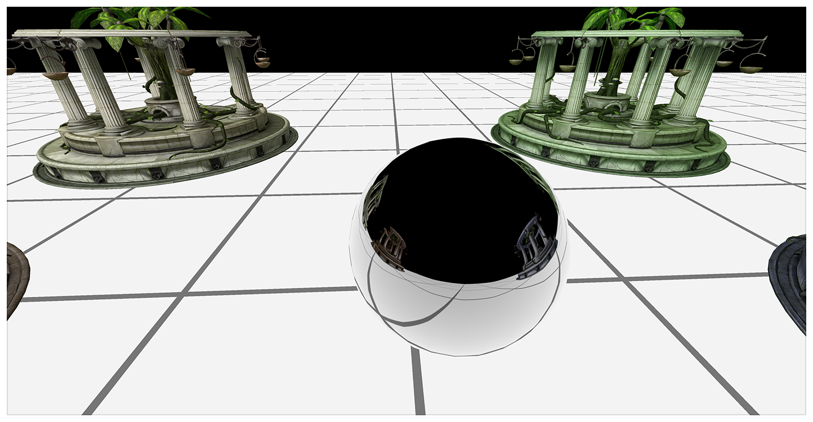
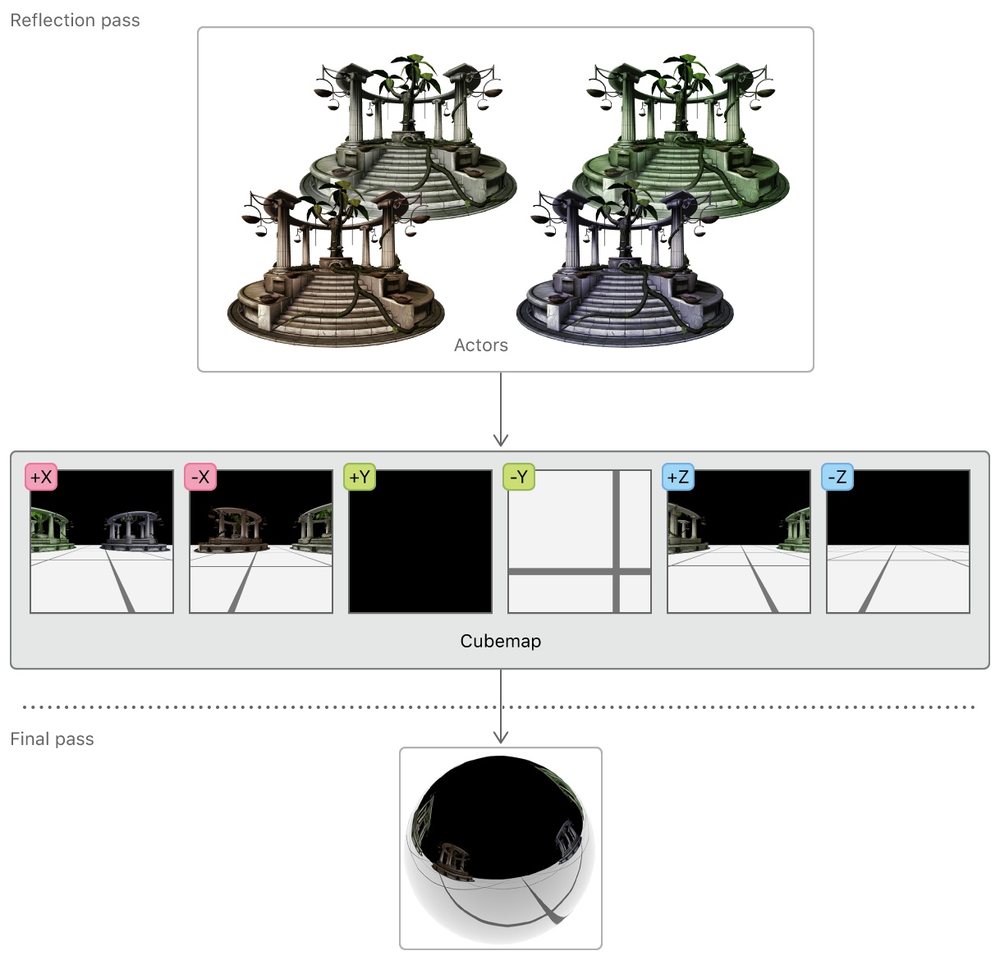
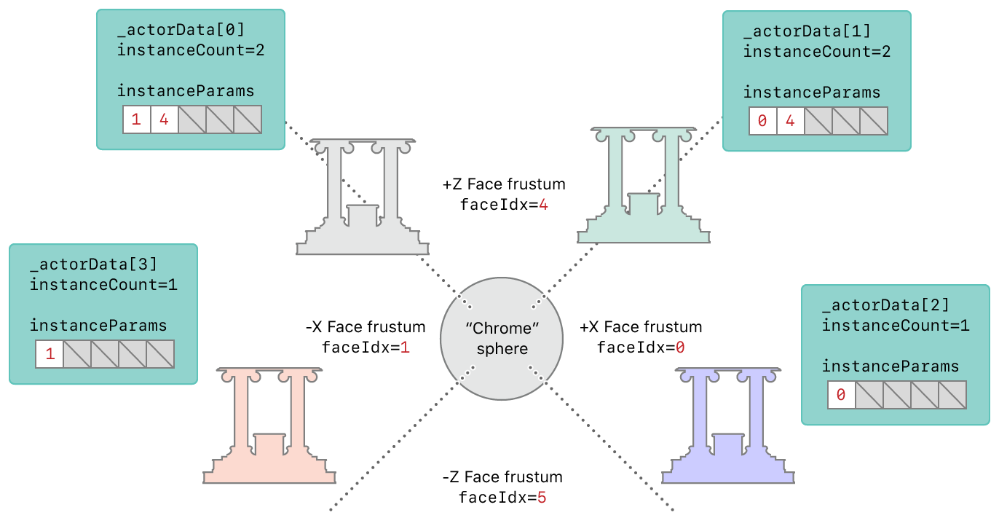
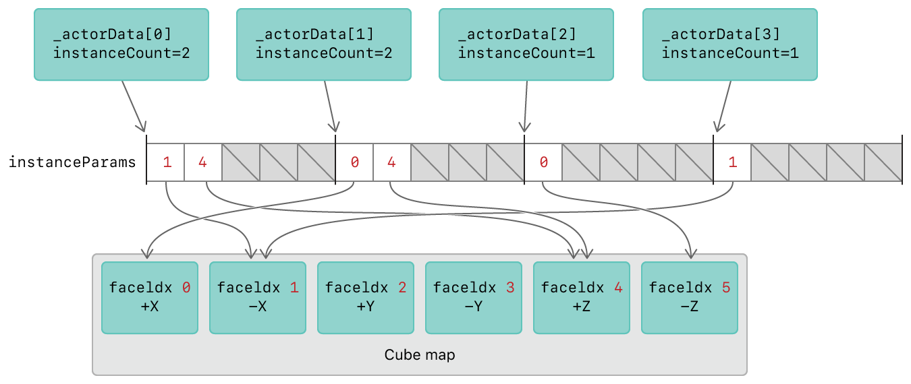

# Reflections with Layer Selection

Demonstrates how to use layer selection to reduce the number of render passes needed to render a reflective object.

## Overview



You can implement an object that reflects its environment by sampling its reflections from a cubemap of the environment. A cubemap is a single texture composed of six 2D texture layers arranged in the shape of a cube. The reflections vary based on the position of other objects in the environment, so each of the cubemap's six faces must be rendered dynamically every frame. This would normally require six separate render passes, one for each face, but Metal allows you to render an entire cubemap in a single pass.

This sample demonstrates dynamic reflections on a chrome sphere, using layer selection to render the frame in two passes. The first pass renders the environment onto the cubemap; the second pass renders the environment reflections onto the sphere, as well as additional actors in the scene and the environment itself.



## Splitting up the Scene

A cubemap is represented as a render target array with six layers, one for each of its faces. The `[[render_target_array_index]]` attribute qualifier, specified for a structure member of a vertex function return value, identifies each array layer separately. This layer selection feature allows you to decide which part of the environment gets rendered to which cubemap face.

An `AAPLActorData` object represents an actor in the scene. In this sample, each actor is a temple model with the same mesh data but a different diffuse color. These actors sit on the XZ-plane; they are always reflected in the X or Z direction relative to the sphere and could be rendered to any of the +X, -X, +Z, or -Z faces of the cubemap.

## Performing Culling Tests for the Reflection Pass

Before rendering to the cubemap, it's useful to know which faces each actor should be rendered to. This procedure is known as a *culling test* and it's performed for each actor for each cubemap face.

At the start of every frame, for each cubemap face, a view matrix is calculated and the view's frustum is stored in the `culler_probe` array.

``` objective-c
// 1) Get the view matrix for the face given the sphere's updated position
viewMatrix[i] = _cameraReflection.GetViewMatrixForFace_LH (i);

// 2) Calculate the planes bounding the frustum using this updated viewMatrix.
//    We use these planes later to test whether an actor's bounding sphere
//    intersects with the frustum, and is therefore visible in this face's viewport.
culler_probe[i].Reset_LH (viewMatrix [i], _cameraReflection);
```

These culler probes are used to test the intersection between an actor and the viewing frustum of each cubemap face. The test results determine how many faces the actor is rendered to (`instanceCount`) and which faces the actor is rendered to (`instanceParams`) in the reflection pass.

``` objective-c
if (_actorData[actorIdx].passFlags & EPassFlags::Reflection)
{
    int instanceCount = 0;
    for (int faceIdx = 0; faceIdx < 6; faceIdx++)
    {
        // if the actor is visible for the current probe face
        if (culler_probe [faceIdx].Intersects (_actorData[actorIdx].modelPosition.xyz, _actorData[actorIdx].bSphere))
        {
            // Add this face index to the the list of faces for this actor
            InstanceParams instanceParams = {(ushort)faceIdx};
            instanceParams_reflection [MaxVisibleFaces * actorIdx + instanceCount].viewportIndex = instanceParams.viewportIndex;
            instanceCount++;
        }
    }
    _actorData[actorIdx].instanceCountInReflection = instanceCount;
}
```

The following diagram shows the test results of the temple actors based on their position relative to the reflective sphere. Because `_actorData[0]` and `actorData[1]` bisect two viewing frustums, their `instanceCount` property is set to 2 and there are 2 elements in their `instanceParams` array (the `instanceParams` array contains the cubemap face indices of the viewing frustums that the actors intersect).



## Configuring Render Targets for the Reflection Pass

The render target for the reflection pass is a cubemap. This is configured by using a `MTLRenderPassDescriptor` object with a color render target, a depth render target, and six layers. The `renderTargetArrayLength` property sets the number of cubemap faces and allows the render pipeline to render into any or all of these faces.

``` objective-c
reflectionPassDesc.colorAttachments[0].texture    = _reflectionCubeMap;
reflectionPassDesc.depthAttachment.texture        = _reflectionCubeMapDepth;
reflectionPassDesc.renderTargetArrayLength        = 6;
```

## Issuing Draw Calls for the Reflection Pass

The `drawActors:pass:` method sets up the graphics rendering state for each actor. Actors are only drawn if they are visible in any of the six cubemap faces, determined by the `visibleVpCount` value (accessed through the `instanceCountInReflection` property). The value of `visibleVpCount` determines the number of instances for the instanced draw call.

``` objective-c
[renderEncoder drawIndexedPrimitives: metalKitSubmesh.primitiveType
                          indexCount: metalKitSubmesh.indexCount
                           indexType: metalKitSubmesh.indexType
                         indexBuffer: metalKitSubmesh.indexBuffer.buffer
                   indexBufferOffset: metalKitSubmesh.indexBuffer.offset
                       instanceCount: visibleVpCount
                          baseVertex: 0
                        baseInstance: actorIdx * MaxVisibleFaces];
```

In this draw call, the sample sets the `baseInstance` parameter to the value of `actorIdx * 5`.  This is important so the vertex function knows how to select the appropriate render target layer for each instance.

## Rendering the Reflection Pass

In the `vertexTransform` vertex function, the `instanceParams` argument points to the buffer that contains the cubemap faces that each actor should be rendered to. The `instanceId` value is used to index into the `instanceParams` array.

``` metal
vertex ColorInOut vertexTransform (         Vertex          in               [[ stage_in ]],
                                            uint            instanceId       [[ instance_id ]],
                                   device   InstanceParams* instanceParams   [[ buffer (BufferIndexInstanceParams) ]],
                                   device   ActorParams&    actorParams      [[ buffer (BufferIndexActorParams)    ]],
                                   constant ViewportParams* viewportParams   [[ buffer (BufferIndexViewportParams) ]] )
```

The output structure of the vertex function, `ColorInOut`, contains the `face` member which uses the `[[render_target_array_index]]` attribute qualifier.  The return value of `face` determines the cubemap face that the render pipeline should render to.

``` metal
typedef struct
{
    float4 position [[position]];
    float2 texCoord;

    half3  worldPos;
    half3  tangent;
    half3  bitangent;
    half3  normal;
    uint   face [[render_target_array_index]];
} ColorInOut;
```

Since the value of the draw call's `baseInstance` parameter was set to `actorIdx * 5`, the `instanceId` value of the first instance drawn in the draw call is equal to this value.  Each subsequent rendering of an instance increments the `instanceId` value by 1. The layout of the `instanceParams` array is such that each actor has 5 slots in the array since there is a maximum of 5 cubemap faces in which an actor could be visible. The use of the `baseInstance` parameter and the layout of the `instanceParams` array means that the `instanceParams[instanceId]` element will always contain one of the face indices in which the actor is visible. Therefore, this value can be used to select a valid render target layer.

``` metal
out.face = instanceParams[instanceId].viewportIndex;
```

In summary, to render each actor to the reflective cubemap, the sample issues an instanced draw a call for the actor. The vertex function uses the built-in `instanceId` variable to index into the `instanceParams` array which contains the index of the cubemap face to which the instance should be rendered to. Therefore, the vertex function sets this face index in the `face` return value member which uses the `[[render_target_array_index]]` attribute qualifier. This ensures that each actor is rendered to each cubemap face it should appear in.



## Performing Culling Tests for the Final Pass

The sample performs similar view updates for the main camera in the final pass. At the start of every frame, a view matrix is calculated and the view's frustum is stored in the `culler_final` variable.

``` objective-c
_cameraFinal.target   = SceneCenter;

_cameraFinal.rotation = fmod ((_cameraFinal.rotation + CameraRotationSpeed), M_PI*2.f);
matrix_float3x3 rotationMatrix = matrix3x3_rotation (_cameraFinal.rotation,  CameraRotationAxis);

_cameraFinal.position = SceneCenter;
_cameraFinal.position += matrix_multiply (rotationMatrix, CameraDistanceFromCenter);

const matrix_float4x4 viewMatrix       = _cameraFinal.GetViewMatrix();
const matrix_float4x4 projectionMatrix = _cameraFinal.GetProjectionMatrix_LH();

culler_final.Reset_LH (viewMatrix, _cameraFinal);

ViewportParams *viewportBuffer = (ViewportParams *)_viewportsParamsBuffers_final[_uniformBufferIndex].contents;
viewportBuffer[0].cameraPos            = _cameraFinal.position;
viewportBuffer[0].viewProjectionMatrix = matrix_multiply (projectionMatrix, viewMatrix);
```

This final probe is used to test the intersection between an actor and the viewing frustum of the camera. The test result simply determines whether or not each actor is visible in the final pass.

``` objective-c
if (culler_final.Intersects (_actorData[actorIdx].modelPosition.xyz, _actorData[actorIdx].bSphere))
{
    _actorData[actorIdx].visibleInFinal = YES;
}
else
{
    _actorData[actorIdx].visibleInFinal = NO;
}
```

## Configuring Render Targets for the Final Pass

The render target for the final pass is the view's *drawable*, a displayable resource obtained by accessing the view's `currentRenderPassDescriptor` property. However, you must not access this property prematurely because it implicitly retrieves a drawable. Drawables are expensive system resources created and maintained by the Core Animation framework; you should always hold a drawable as briefly as possible to avoid resource stalls. In this sample, a drawable is acquired just before encoding the final render pass.

``` objective-c
MTLRenderPassDescriptor* finalPassDescriptor = view.currentRenderPassDescriptor;

finalPassDescriptor.renderTargetArrayLength = 1;
id <MTLRenderCommandEncoder> renderEncoder =
    [commandBuffer renderCommandEncoderWithDescriptor:finalPassDescriptor];
renderEncoder.label = @"FinalPass";

[self drawActors: renderEncoder pass: EPassFlags::Final];

[renderEncoder endEncoding];
```

## Issuing Draw Calls for the Final Pass

The `drawActors:pass`: method sets up the graphics rendering state for each actor. Actors are only drawn if they are visible to the main camera, determined by the `visibleVpCount` value (accessed through the `visibleInFinal` property).

In the final pass, the `instanceCount` parameter is always set to 1 and the `baseInstance` parameter is always set to 0 since each actor is only drawn once in the final pass.

## Rendering the Final Pass

The final pass renders the final frame directly to the view's drawable, which is then presented onscreen.

``` objective-c
// Schedule a present once the framebuffer is complete using the current drawable
[commandBuffer presentDrawable:view.currentDrawable];
```
