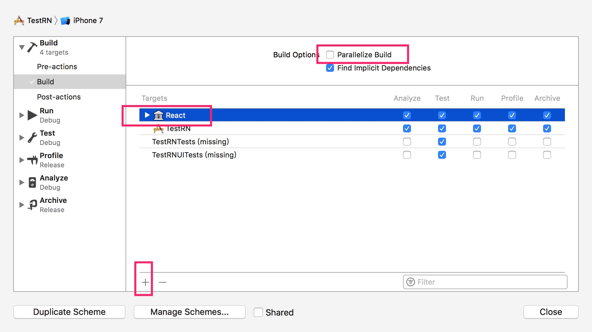

# 把 Reative Native 47 版本集成到已有的 Native 工程中 
##  一、搭建开发环境 
http://reactnative.cn/docs/0.46/getting-started.html#content

## 二、创建一个模板   
运行以下命令，创建一个最新版本的 reactive-native 的环境。RN 的版本如下： 

    react-native init MyTestRnWithNative
    react-native -v
    react-native-cli: 2.0.1
    react-native: 0.47.1  
    
得到以下的工程目录。其中iOS文件夹中是 Native 的工程，`index.ios.js` 是用来生成 JS 代码的。

其中打开工程文件，可以看到在 Build Phases 有额外的一个步骤，是用来启动服务器的。  

## 三、新建一个 Native 的工程    
移除 ios 文件夹中所有文件，在 ios 文件夹中用 Xcode 新建一个 iOS 的工程，并把 `Allow Arbitrary Loads` 的值设为 YES，允许本地服务器访问。  

## 四、链接 RN 的库到工程中
### 引入 RN 的库到工程中      
如下图所示，把需要引入的库拖入工程的 Library Group里

  

我链接了如下几个库。其中 React 库位于 `node_modules/react-native/React` 文件夹中，其它 5 个库分别位于 `node_modules/react-native/Libraries` 文件夹下。

### 链接静态库
方法如下，把 6 个子工程的 `Products` 目录下的 `.a` 文件拖入工程的 `Link Binary With Library` 选项中。

### 设置头文件路径  
在 `Build Settings` 的 `Header Search Paths` 选项中，把工程的头文件设置正确。下面是设置完之后的截图。  

## 五、设置启动 node 服务器的脚本  
  

    export NODE_BINARY=node
    ../node_modules/react-native/scripts/react-native-xcode.sh
## 六、写入 Demo 代码  

    #import <React/RCTBundleURLProvider.h>
    #import <React/RCTRootView.h>
    
    //viewDidLoad    
    NSURL *jsCodeLocation;
    
    jsCodeLocation = [[RCTBundleURLProvider sharedSettings] jsBundleURLForBundleRoot:@"index.ios" fallbackResource:nil];
    
    RCTRootView *rootView = [[RCTRootView alloc] initWithBundleURL:jsCodeLocation
                                                        moduleName:@"Bananas"
                                                 initialProperties:nil
                                                     launchOptions:nil];
    rootView.backgroundColor = [[UIColor alloc] initWithRed:1.0f green:1.0f blue:1.0f alpha:1];
    
    rootView.frame = CGRectMake(100, 200, 200, 400);
    [self.view addSubview:rootView];

## 七、解决若干问题  
### 'React/RCTBundleURLProvider.h' file not found    
如下所示，去掉 `Prarllelize Build`选项，新增一个 Target。
  

###  RCTWebSocket编译报错
>打开工程中的RCTWebSocket.xcodeproj -> build settings > all -> Apple LLVM 8.0 - Custom Comple Flags -> 去掉 Other Warning Flags中-Werror -Wall 值后重新编译即可。

## 八、Run  

## 参考  
1. [搭建开发环境](http://reactnative.cn/docs/0.46/getting-started.html#content)  
2. [Linking Libraries](https://facebook.github.io/react-native/docs/linking-libraries-ios.html)
3. [XCode升级到8.0后RCTWebSocket编译报错](http://www.findsrc.com/react-native/detail/8675)

