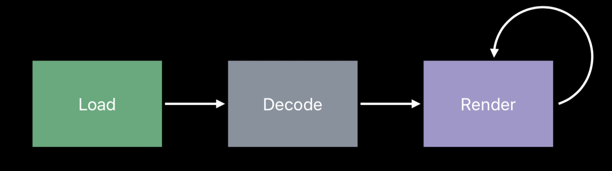
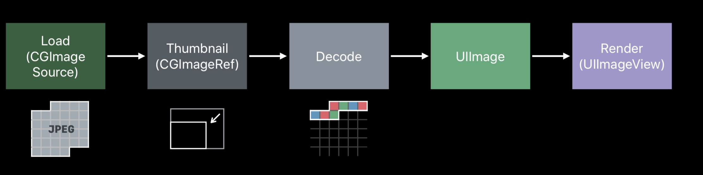
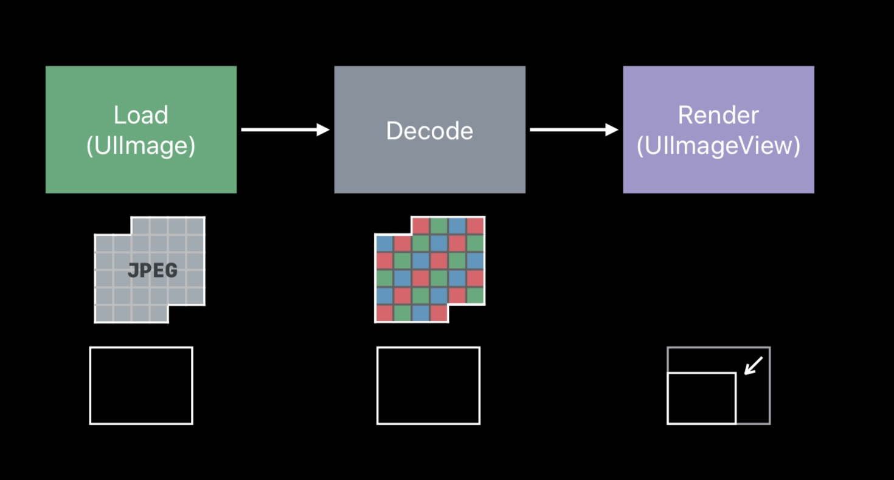

# 图像最佳实践。
## 图像的显示过程。
1. 压缩后的图像加载到内存中， Data Buffer
2. 图像解码，放在 Image Buffer 中
3. 放到 Image Buffer 中，渲染到屏幕上

## 解码时注意的一点
> Proportional to original image size, not view size. 

解码后，占用内存大小，和原始图片的大小成正比，而不是和要显示的区域大小成正比。如果原始图片比要显示的区域大很多，就需要降采样。

## 降采样
  

可以看到，降采样后，减少了很多内存占用。

    func downsample(imageAt imageURL: URL, to pointSize: CGSize, scale: CGFloat) -> UIImage {

	//生成CGImageSourceRef 时，不需要先解码。
	let imageSourceOptions = [kCGImageSourceShouldCache: false] as CFDictionary
	let imageSource = CGImageSourceCreateWithURL(imageURL as CFURL, imageSourceOptions)!
	let maxDimensionInPixels = max(pointSize.width, pointSize.height) * scale
	
	//kCGImageSourceShouldCacheImmediately 
	//在创建Thumbnail时直接解码，这样就把解码的时机控制在这个downsample的函数内
	let downsampleOptions = [kCGImageSourceCreateThumbnailFromImageAlways: true,
								 kCGImageSourceShouldCacheImmediately: true,
								 kCGImageSourceCreateThumbnailWithTransform: true,
								 kCGImageSourceThumbnailMaxPixelSize: maxDimensionInPixels] as CFDictionary
	//生成
	let downsampledImage = CGImageSourceCreateThumbnailAtIndex(imageSource, 0, downsampleOptions)!
	return UIImage(cgImage: downsampledImage)
}            

## 获取展示的缩放比例

    collectionView.traitCollection.displayScale

## Decoding in Scrollable Views
在 scrollview 中，可以通过两个方法来提高性能。

- Prefetching
- Background decoding/downsampling

## 图片绘制 
- 减少调用 `draw` 方法
- `UIView.backgroundColor` 不会产生 backing store
- pattern color 会产生 backing store， 要使用带有 titling image 的 UIImageView 来达到同样效果
- `UIView.maskView` 和 `CALayer.maskLayer` 需要临时的 image buffer， `CALayer.cornerRadius` 不需要临时的 image buffer
- 使用 `UIImage.withRenderingMode(_:)` 设置为 `alwaysTemplate`，可以直接渲染进 frame buffer， 不需要临时的 image buffer
- 使用 `UIGraphicsImageRenderer` ，而不是 `UIGraphicsBeginImageContext()`。 前者支持广域色彩

## 参考
- [Image and Graphics Best Practices](https://techblog.toutiao.com/2018/06/19/untitled-42/)

- [WWDC2018 图像最佳实践](https://juejin.im/post/5b1a7c2c5188257d5a30c820)
- [WWDC2018 Image and Graphics Best Practices](https://developer.apple.com/videos/play/wwdc2018/219/)
- [Demo](https://github.com/huahuahu/learn/tree/master/iOS/ImageDownSampleDemo)
