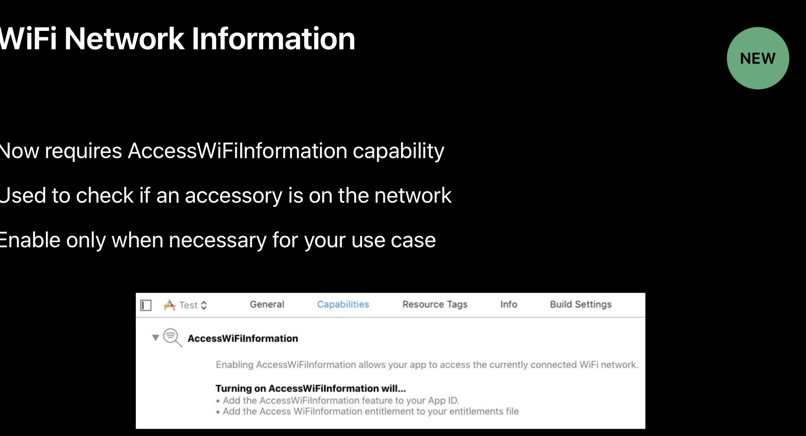
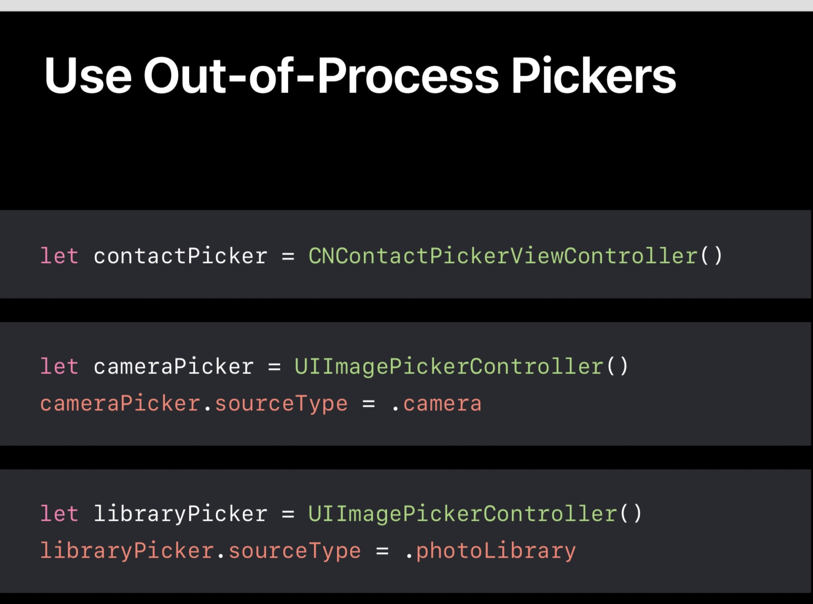
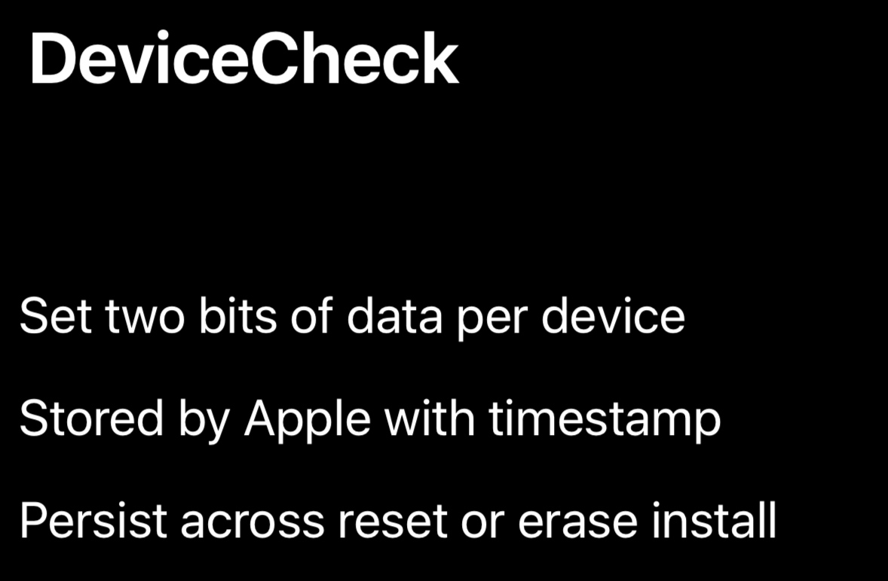
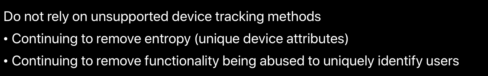

# iOS 12 隐私保护
## 获取 Wi-Fi 信息需要用户同意  

## 进程外获取图片
new in iOS12。

## 追踪设备  
要用苹果提供的方法，即使重装手机也不会失效。 但是只有两个比特。  

苹果会继续移除可以用作设备指纹的信息。  

## 第三方应用。
> You’re responsible for all code in your app

这句话说得好

## 参考。
- 
- [Better Apps through Better Privacy](https://developer.apple.com/wwdc18/718)

