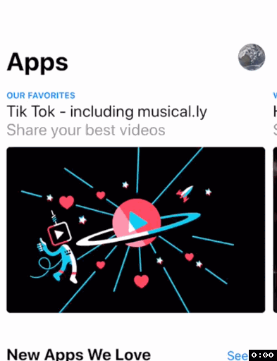
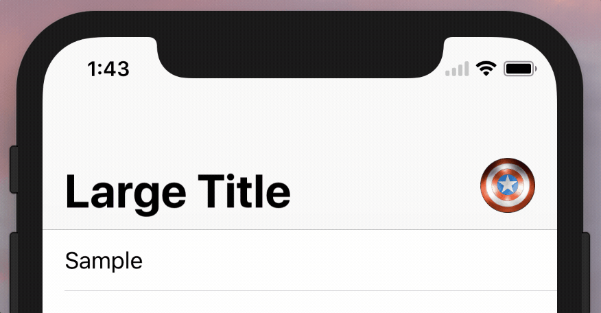
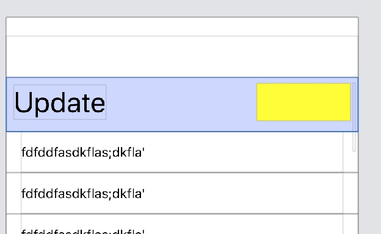
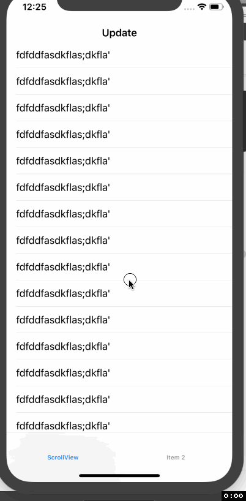
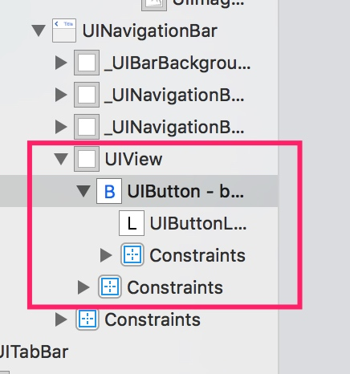
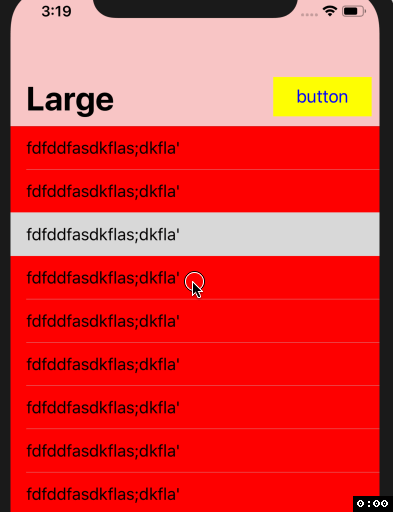
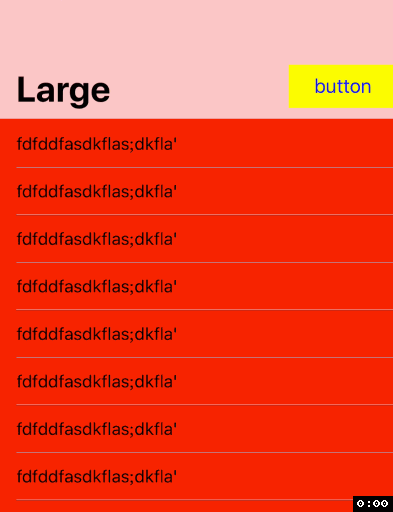
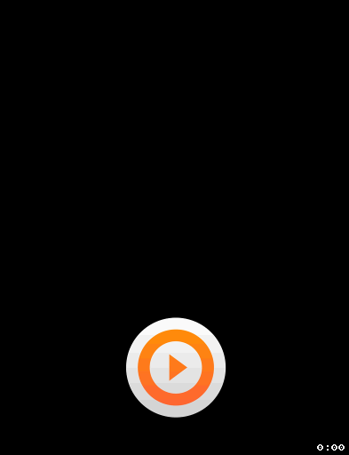

# 模仿 AppStore 顶部动画  

## App Store 顶部动画  
App Store 中 Games、Apps、Updates 的顶部动画的特点：  

- 自然状态下是大标题，右边有一个 button  
- 顶上去时，变成小标题，右边按钮消失
- 导航栏有毛玻璃效果的，可以透过底部的内容
- 自然状态下，点击列表项进入下一级，大标题自动变为返回按钮，并有动画无缝衔接  

## 网上提供的方案  
网上提供的方案是在导航栏中以 subView 的方式加入一个 button，然后在 scrollview 的 `scrollViewDidScroll` 方法中，调整 button 的位置和大小。 
  

和 App Store 的效果区别在，
- 导航栏从大标题变为小标题过程中，按钮仍然是完全可见的。在 App Store 中，导航栏由大标题变为小标题的过程中，按钮是部分被截断的。
于是自己打算自己写一个 Demo

## 尝试一（失败）
基本想法是把 Title 和 Button 作为 TableView 的 HeaderView，然后在 `scrollViewDidScroll` 中，设置 title。  

    override func scrollViewDidScroll(_ scrollView: UIScrollView) {
        if scrollView.contentOffset.y > 64 {
            self.navigationItem.title = "Update"
        } else {
            self.navigationItem.title = nil
        }
    }

效果如下：  

可以看到和 App Store 不同点在于，
- 大标题下，点击跳转，没有动画。因为此时上一个 VC 的 Title 是 nil
- 下拉过程中，标题没有变大的效果

## 尝试二  
模仿网上的例子，使用系统的 largeTitleBar，在 navBar 上 addSubView

  

button 的 frame 不变，底部和 view 对齐。在滑动过程中，改变父 view 的大小，这样子可以有截断的效果，仍然保留了系统导航栏的下拉变大、控制器导航动画。效果如下：  

但是仍有一个地方不好，就是 button 只有隐藏和显示两个状态，没有 alpha 值的变化。   

### 加上 alpha 特效  
根据返回手势的进度，调整 view 的 alpha 值即可。  
navigationController 有一个手势属性 `interactivePopGestureRecognizer`。可以响应这个手势，得到转场动画的进度。  

        navigationController?.interactivePopGestureRecognizer?.addTarget(self, action: #selector(type(of: self).onGesture(sender:)))

    @objc func onGesture(sender: UIGestureRecognizer) {
        switch sender.state {
        case .began, .changed:
            if let ct = navigationController?.transitionCoordinator {
                topview.alpha =  ct.percentComplete
            }
        case .cancelled, .ended:
            return
        case .possible, .failed:
            break
        }
    }

效果如下：  

## 参考 
- [去掉 navigationBar 下面的一条横线](https://www.jianshu.com/p/d32aeb442537)
- [How to build resizing Image in Navigation Bar with Large Title](https://blog.uptech.team/how-to-build-resizing-image-in-navigation-bar-with-large-title-8ba2e8bcb840)
- [Add a button to large title navigation bar](https://stackoverflow.com/questions/46741945/add-a-button-to-large-title-navigation-bar)
- [Get progress of UINavigationController swipe back](https://stackoverflow.com/questions/46787759/get-progress-of-uinavigationcontroller-swipe-back)
- [demo](https://github.com/huahuahu/learn/tree/master/iOS/UIKit/AppStoreAnimation)
