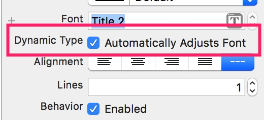

# Dynamic Type  

## 啥是 Dynamic Type  
动态字体，即视力不好的用户，调整了默认字体的大小，开发者应该根据这个设置，动态改变界面的字体等，保证用户能看得清楚。  
这个还是蛮重要的，视力不好的人越来越多。  
## 用户在哪里调整  
  
打开了开关之后，底部明显调整更大了。   
  

## 开发者怎么知道用户设置了多大的字体    
通过监听一个通知即可  

        NotificationCenter.default.addObserver(forName: NSNotification.Name.UIContentSizeCategoryDidChange, object: .none, queue: OperationQueue.main) { (notify) in
            let aa: UIContentSizeCategory = notify.userInfo?[UIContentSizeCategoryNewValueKey] as! UIContentSizeCategory
            print(aa)
        }

可以有很多种  

## 如何自动调整 Lable 的大小  
### 使用 StoryBoard  
1. font 指定为某种 style  
  
2. 选择 Automatically Adjusts Font  
   
### 使用代码  

        label.font = UIFont.preferredFont(forTextStyle: .title2)
        label.adjustsFontForContentSizeCategory = true
        label.firstBaselineAnchor.constraintEqualToSystemSpacingBelow(storyLable.lastBaselineAnchor, multiplier: 1).isActive = true
        label.centerXAnchor.constraint(equalTo: storyLable.centerXAnchor).isActive = true

### 效果如下  

## 为自定义字体自动缩放  
        let fontName = "Futura-MediumItalic"
        guard let customFont = UIFont.init(name: fontName, size: UIFont.labelFontSize) else {
            print("not found font \(fontName)")
            return
        }

        let customLabel = UILabel.init()
        customLabel.font = UIFontMetrics.default.scaledFont(for: customFont)

## 为视障患者提供大图片  
### 各种 bar （底部 tabbar、顶部导航栏）
因为 bar 大小固定，苹果提供了一种方式，长按时，放大显示。  

1.  使用storyboard  
    有两种方式  
    
    1. 使用向量版本的图片，保证缩放信息  
    
          
    
    1. 同时制定一个大图 (75 pt) 和一个小图  
        
2. 使用代码  
使用 `largeContentSizeImage` 属性。  

        self.tabBarItem.image = UIImage.init(imageLiteralResourceName: "layoutsmall")
        self.tabBarItem.largeContentSizeImage = UIImage.init(imageLiteralResourceName: "layoutbig")

### 一般图片  
1. 使用 storyboard  
    

2. 使用代码  
    
        imageView.adjustsImageSizeForAccessibilityContentSizeCategory = true

## 其他技巧  
 1. number of lines 设为 0  
这样子大字号时，可以不被截断  
2. 文字之间布局时，使用系统提供的间距  
    
        customLabel.firstBaselineAnchor.constraintEqualToSystemSpacingBelow(label.lastBaselineAnchor, multiplier: 1).isActive = true
        
1. 使用缩放后的值  
    
        frame.origin.y += UIFontMetrics.default.scaledValue(for: 40.0)

1. 根据不同的 Text Size 采用不同的布局  
     
      
    感觉这个也不咋智能。  
      
    比如不同的文字大小，布局是不同的。  
    

## 参考  
- [Building Apps with Dynamic Type](https://developer.apple.com/wwdc17/245)
- [Creating Self-Sizing Table View Cells](https://developer.apple.com/documentation/uikit/uifont/creating_self_sizing_table_view_cells)
- [Getting a Scaled Font](https://developer.apple.com/documentation/uikit/uifont/getting_a_scaled_font)
- [demo](https://github.com/huahuahu/learn/tree/master/iOS/UIKit/DynamicTypeDemo)

