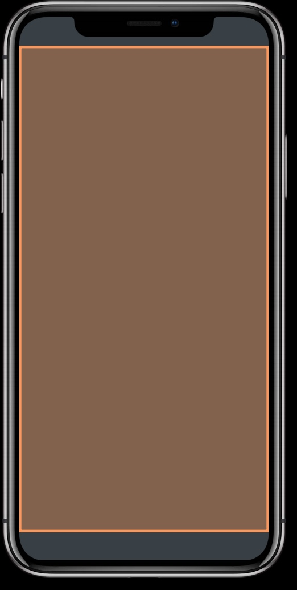
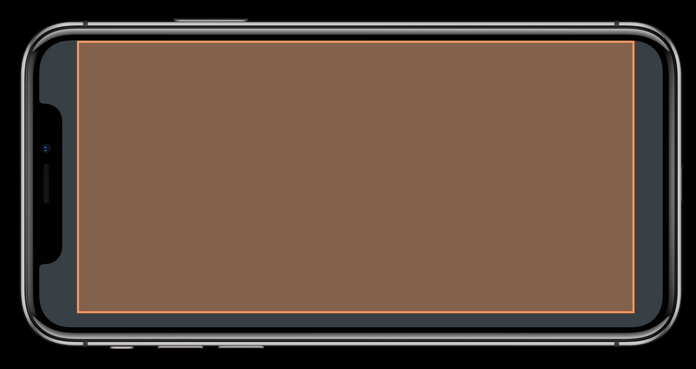
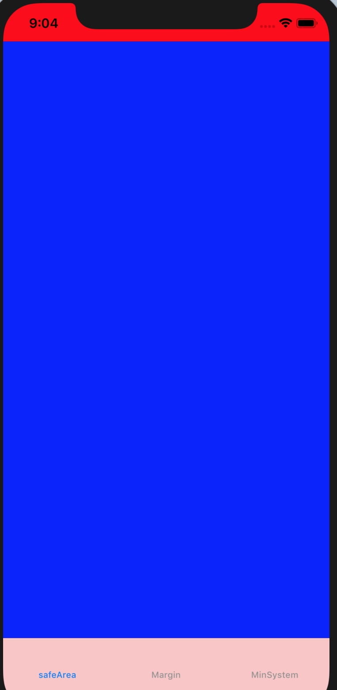
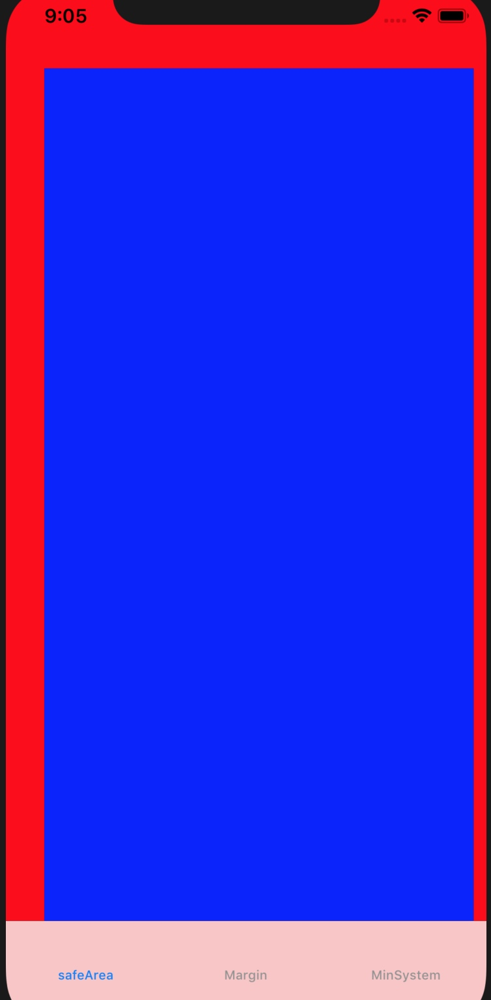
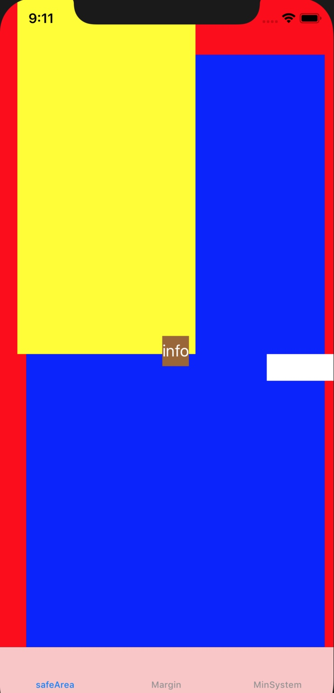
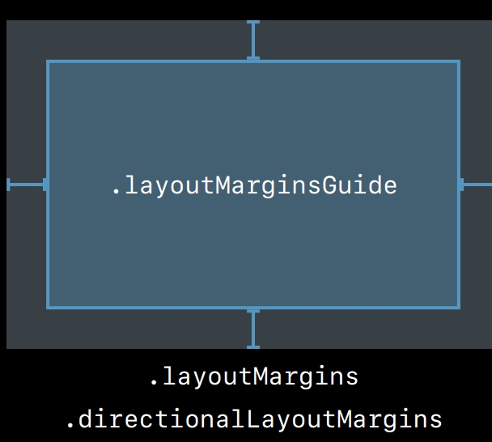
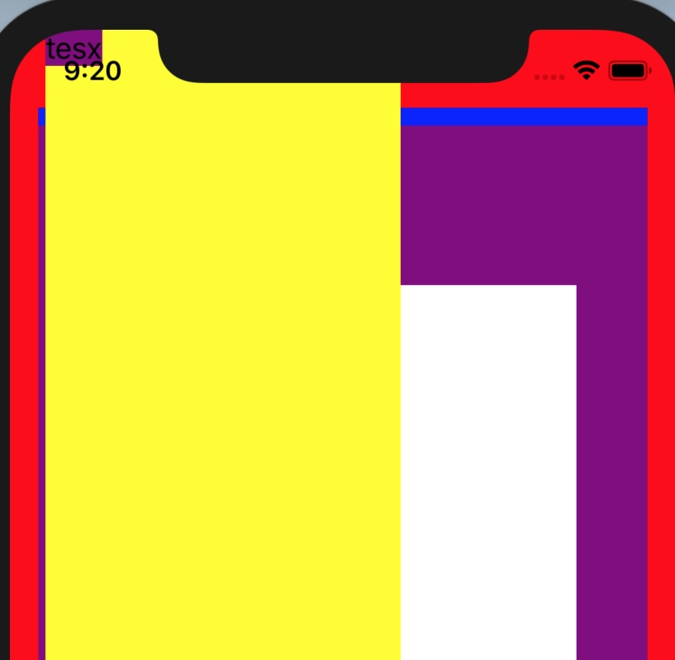
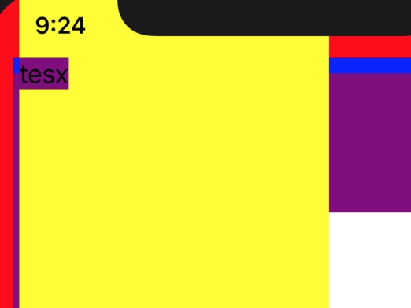
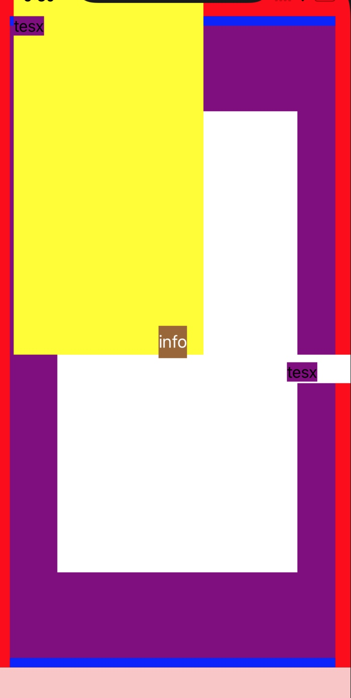
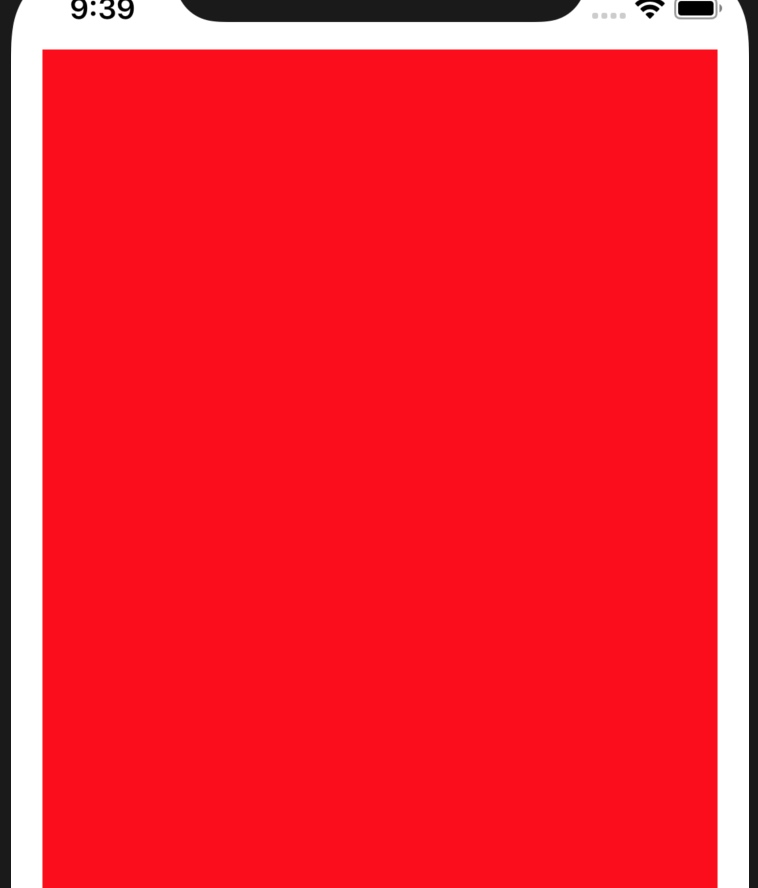

# UIKit: Apps for Every Size and Shape
## safeArea  
即可以正常显示内容的部分。
  
  

### 可以通过 `additionalSafeAreaInsets` 来调整 safeArea 的大小。
  

经过调整，范围如下：  

    self.additionalSafeAreaInsets = UIEdgeInsets.init(top: 20, left: 30, bottom: 0, right: 10)

### 通过 `safeAreaLayoutGuide` 创建约束  
        bgView.topAnchor.constraint(equalTo: view.safeAreaLayoutGuide.topAnchor),
        bgView.bottomAnchor.constraint(equalTo: view.safeAreaLayoutGuide.bottomAnchor),
        bgView.leadingAnchor.constraint(equalTo: view.safeAreaLayoutGuide.leadingAnchor),
        bgView.trailingAnchor.constraint(equalTo: view.safeAreaLayoutGuide.trailingAnchor)

### subView 的 safeAreaInsets
1. 完全在内部的，`safeAreaInsets` 为 0
2. 部分在 supview 内部，但在 safeArea 之外的，`safeAreaInsets` 为之间的大小
3. 在 superview 之外的，为父 view `safeAreaInsets` 的大小，不会延伸出去

  

    view safeArea: UIEdgeInsets(top: 64.0, left: 30.0, bottom: 83.0, right: 10.0)
    bgview SafeArea: UIEdgeInsets(top: 0.0, left: 0.0, bottom: 0.0, right: 0.0)
    topview SafeArea: UIEdgeInsets(top: 64.0, left: 10.0, bottom: 0.0, right: 0.0)
    rightView SafeArea: UIEdgeInsets(top: 0.0, left: 0.0, bottom: 0.0, right: 10.0)

如上所示，蓝色完全在 rootview 的 safeArea 之内，所以 `safeAreaInsets` 为0.  
topview 在 rootview 的 bounds 之内，但是在 safeArea 之外，所以 `safeAreaInsets` 反映了在 rootview 的 bounds 之内， safeArea 之外的区域。  
rightView 的右边已经超出了屏幕范围，所以 `safeAreaInsets` 的右边是 rootview 的 `safeAreaInsets` 的右边，不会继续超出。  

## Margin
即内间距

### 使用 `layoutMarginsGuide` 来创建约束  
    bgView.topAnchor.constraint(equalTo: view.layoutMarginsGuide.topAnchor),
    bgView.bottomAnchor.constraint(equalTo: view.layoutMarginsGuide.bottomAnchor),
    bgView.leadingAnchor.constraint(equalTo: view.layoutMarginsGuide.leadingAnchor),
    bgView.trailingAnchor.constraint(equalTo: view.layoutMarginsGuide.trailingAnchor)
    
### insetsLayoutMarginsFromSafeArea 属性 
> When the value of this property is true, any margins that are outside the safe area are automatically modified to fall within the safe area boundary. The default value of this property is true. Changing the value to false allows your margins to remain at their original locations, even when they are outside the safe area.  

即这个属性可以保证不落在 safeArea 区域之外  

  

        // 这里可以修改 layoutmargin
        topView.layoutMargins = UIEdgeInsets.init(top: 0, left: 0, bottom: 0, right: 0)
        [topView, rightView].forEach { (viewa) in
            let label = UILabel.init()
            label.translatesAutoresizingMaskIntoConstraints = false
            label.backgroundColor = UIColor.purple
            viewa?.addSubview(label)
            label.text = "tesx"
            let labelConstranits = [label.topAnchor.constraint(equalTo: viewa!.layoutMarginsGuide.topAnchor),
                                   label.leftAnchor.constraint(equalTo: viewa!.layoutMarginsGuide.leftAnchor)]
            NSLayoutConstraint.activate(labelConstranits)
            // 如果这个是false，那么topview中的label，可以出现在safeArea区域之外 topView.layoutMargins维持为0
            // 如果这个是true，那么topview的lable一定在safeArea之内。topView.layoutMargins也会变化
            viewa!.insetsLayoutMarginsFromSafeArea = false
        }

如上图所示，lable 落在了 safeArea 之外，如果把 `insetsLayoutMarginsFromSafeArea` 设置为 true，结果如下：  

值得注意的是，创建约束时，一定要用 `layoutMarginsGuide`，否则，即使`insetsLayoutMarginsFromSafeArea` 设置为 true，也会落在 safeArea 之外。

### preservesSuperviewLayoutMargins
> When the value of this property is true, the superview’s margins are also considered when laying out content. This margin affects layouts where the distance between the edge of a view and its superview is smaller than the corresponding margin. For example, you might have a content view whose frame precisely matches the bounds of its superview. When any of the superview’s margins is inside the area represented by the content view and its own margins, UIKit adjusts the content view’s layout to respect the superview’s margins. The amount of the adjustment is the smallest amount needed to ensure that content is also inside the superview’s margins.

文档写的有点稀里糊涂的，我们看一个例子。

- 蓝色的 view 上加了一层紫色的 view， 紫色的 view 上加了白色的 view
- 蓝色 view 的 `layoutMargins`为 `(top: 100, left: 50, bottom: 100, right: 40)`
- 紫色 view 的约束为顶部的底部差10，左右展开  
- 紫色 view 的 `preservesSuperviewLayoutMargins` 为 true
- 白色 view 的约束为上下左右和紫色 view 的 `layoutMarginsGuide` 对齐
- 紫色 view 的 `layoutMargins` 为 `(top: 0, left: 0, bottom: 0, right: 0)`

如果 `preservesSuperviewLayoutMargins` 为 false，那么白色 view 和紫色 view 大小完全一致。由于这个属性为 true，所以紫色 view 在布局时，考虑到了父 view 的 `layoutMargins`，因此白色 view 大小被缩减了。  

### viewRespectsSystemMinimumLayoutMargins  
系统的 VC 有一个默认的最小内间距，只读不可写，称为 `systemMinimumLayoutMargins`。  
即使我们设置了 rootview 的 `directionalLayoutMargins`，如果太小的话，系统会会退到系统默认的最小间距。  
  

如上所示，VC 的 rootView 的内间距被设为了零，按照 `layoutMarginsGuide` 创建约束，左右仍然有内间距。是因为这个VC 的 `systemMinimumLayoutMargins` 为 `(top: 0.0, leading: 16.0, bottom: 0.0, trailing: 16.0)`。  
如果把 `viewRespectsSystemMinimumLayoutMargins` 设置为 false，就可以扩展到边缘了。  

## 参考 
- [UIKit: Apps for Every Size and Shape](https://developer.apple.com/videos/play/wwdc2018/235/)
- [Preserves Superview Layout Margins](https://useyourloaf.com/blog/preserves-superview-layout-margins/)
- [imanoupetit/Margins-And-Safe-Area](https://github.com/imanoupetit/Margins-And-Safe-Area)
- [demo](https://github.com/huahuahu/learn/tree/master/iOS/UIKit/autolayout/SafeAreaAndLayoutMargin)