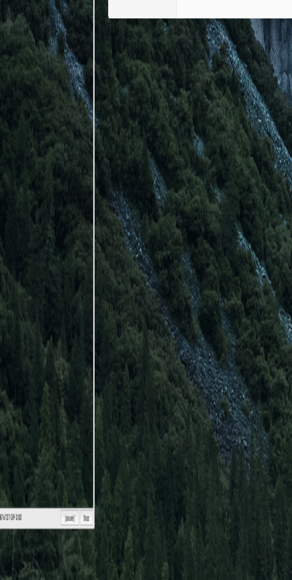

# 一个自动换行，不可以滚动的 textview  

## 主要效果有几点  
 - 只显示一行文字
 - 输入文字过长时，自动换行
 - 上下不可以滑动
 - 删除时，自动显示上一行文字。
 
## 如何做到

1. 只显示一行

                           textView.heightAnchor.constraint(equalToConstant: textView.font!.lineHeight),

1. 自动换行 
    这是 textView 自带的功能，不禁用滑动功能就好

1. 上下不可以滑动  
    在 `scrollViewDidScroll` 里，强制设置 `contentOffset`

1. 删除时，自动显示上一行文字 
    也是 textView 自带的功能

## 参考 
 - [Demo]()
 