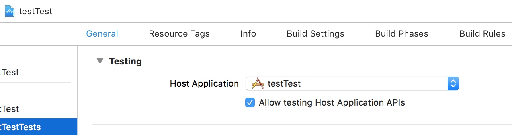
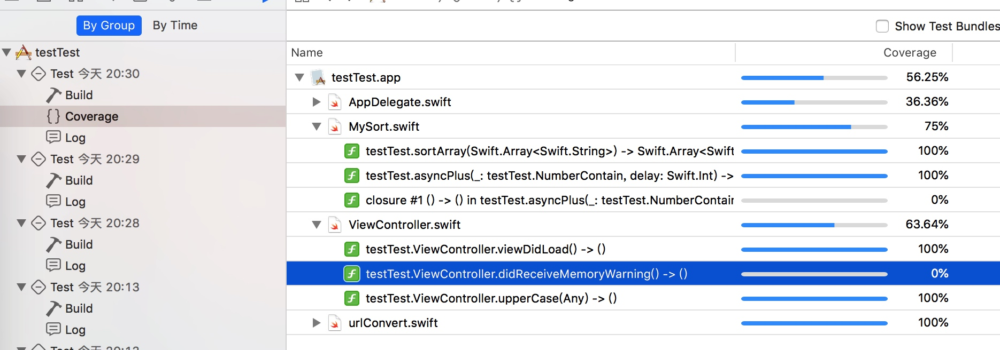

# XCTest Basic
## Test Targets, Test Bundles, and the Test Navigator  
> Adding a test target to a project creates a test bundle  

所以说，一个 target 对应一个 bundle  

## test 流程 
- 每一个类，运行一次类的 setup 方法  
    - 每一个方法，生成一个类的实例  
    - 调用实例的 setup 方法  
    - 运行这个方法  
    - 调用实例的 teardown 方法  
- 继续其他方法  
- 运行一次类的 teardown 方法  

## Test Methods  
> A test method is an instance method of a test class that begins with the prefix test, takes no parameters, and returns void  

三个特征：  

1. `test`开头 
2. 没有参数  
3. 返回时空

## 异步测试与 XCTestExpectatio 
### 测试成功

        let expectation =  self.expectation(description: "expectation description")
        DispatchQueue.main.asyncAfter(deadline: DispatchTime.now() + 2.0) {
            expectation.fulfill()
            XCTAssert(numberCantain.number == 2)
            print("fullFill")
        }
        
        self.waitForExpectations(timeout: 3) { (error) in
            print("time out")
        }
        print("end")

2 秒后，调用 `expectation.fulfill()` ，此时，还没有超过 3 s。 block 中的代码也被执行 

    fullFill
    time out
    end
### 测试失败  

        let expectation =  self.expectation(description: "expectation description")
        DispatchQueue.main.asyncAfter(deadline: DispatchTime.now() + 2.0) {
            expectation.fulfill()
            XCTAssert(numberCantain.number == 2)
            print("fullFill")
        }
        
        self.waitForExpectations(timeout: 1) { (error) in
            print("time out")
        }
        print("end")

1 s 后，`waitForExpectations` 已经到期，因此执行了 block 中的方法。并标记为失败。  

输出如下：  

    time out
    ... Asynchronous wait failed: Exceeded timeout of 1 seconds, with unfulfilled expectations: "expectation description".
    end
    instance teardown

## 如何获取到被测试对象的 internal 属性、方法  
分两步 

1. `Enable Testability` 编译选项设置为 `YES`。
  
这样子在变异之后，就会加入 `-enable-testing` 标志。于是被编译的 Swift entities 有可能提高访问控制等级  

1. 在引入模块时，加上 `@testable`。这样子，这个模块的 elevated access 就被激活了。具体来说， `internal`  和`public` 变成了 `open`，`internal` 变成了 `public`

  
  
当你把模块给别人时，会把 `Enable Testability` 关掉，这样子别人就不知道你的内部实现了。  

## 选择不同的 associated build product
1. 选择 host application 
      

    所有测试，会在这个 app 的  `applicationDidFinishLaunching` 运行之后执行。运行在启动的 app 进程

1. 选择 library  
     >  Xcode bootstraps the testing runtime context, the library or framework, and your test code is hosted by a process managed by Xcode。  
     
     运行在 Xcode 管理的进程。  
     

## debug 测试过程  
1. 加测试失败断点  
      
    
## 代码覆盖   
在 schema 的 test 设置里，  

结果如下，可以看到每个类、每个方法的测试情况  
    

## 使用脚本测试  

    xcodebuild test -project testTest.xcodeproj -scheme testTest -destination platform='iOS Simulator,name=iPhone 8,OS=12.0'

如上所示，使用 `test` 指令，来进行测试。通过  `-destination` 指定运行的设备，可以是模拟器，也可以是设备。  

把这句话放到脚本里，就可以运行脚本来测试。  

### ssh 与 xcodebuild  
进行测试，必须在一个 `Aqua session`，这个会话初始化了 Mac OS 交互式环境，这个环境是运行保护 UI 框架的基础。在 Mac OS 上测试，必须要有一个 `Aqua session`。  
简单的方法就是在这台电脑上登陆。

## UI Test  
### UI Test 的测试代码在单独进程运行
> Your test code runs as a separate process, synthesizing events that UI in your app responds to

边运行，边分析启动 app 对事件的响应。  

### 据说在测试失败时，会有截图
> Test reports are enhanced to provide detailed information about UI tests, including snapshots of the state of the UI at test failures.

但是没发现，似乎有一个bug。

### 在 UI Test 时，如何获取 label 的当前文本 
目前没找到方法 

>> The only way I've found is to not set an Accessibility Label, but use identifier instead. Then XCUIElement.label will change to match the current text of the label.

>>However there is a gotcha: if you have previously set Accessibility Label in XC, and remove it, an entry setting the label to "" remains in the storyboard. In this case, not only will calling .label will return "", but you won't be able to query for the label by it's text!

>>The ony thing you can do is delete and re-add the label, or manually edit the xml.

>Just three letters: O M G 

>Thank you for this insight into the ridiculous behaviour of XCode!

## 参考  
- [https://forums.developer.apple.com/thread/10428](Get UILabel during UI testing)
- [UI Testing Failure - Failure getting snapshot](https://forums.developer.apple.com/message/194178#194178)

